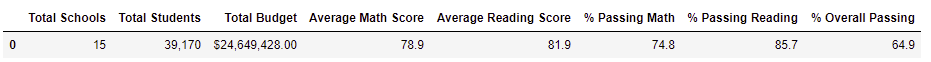

# School_District_Analysis
## Project Overview
School board has requested performance analysis of district schools on math and reading tests for students from 9th to 12th grades. After the first analysis was complete in accordance with all the requirements, it was revealed one of the schools detected academic dishonesty. The reading and math scores for ningth graders at Thomas High School were altered. Following this discovery, the board commissioned another analysis of the data, this time by removing the results of reading and math tests of ninth graders and Thomas High School from the analysis. 

## Results
Math and reading scores of 461 9th graders at Thomas High School (THS) were replaced with null values:

Following the removal of THS 9th graders' scores from the dataframe, the following differences between the initial and corrected analysis can be noted:  

### District summaries
* District summary with THS 9th grade scores included:

* District summary with THS 9th grade scores removed:

Only minor discrepancies in the "Average Math Score", "% Passing Math", "% Passing Reading", and "% Overall Passing" resulted for the district summary following the correction. 

### School Summaries
* THS school summary with the THS 9th grade scores included:

* THS school summary with the THS 9th grade scores removed:

Following the removal of scores of 461 9th graders, THS saw an increase in the rate of students with passing scores in math, reading, and both math and reading tests. The passing rates at THS are lower with the 9th grader’s scores included: 66.9% in math, 69.6% in reading, and 65% overall. THS’ performance after the removal of the instances of academic dishonesty in the 9th grade tests shows a significant increase in the passing rates: 93.1% of students passed math, 97% passed reading, and over 90% passed overall.

### THS's Performance Relative to Other Schools in the District
* THS's ranking with the THS 9th grade scores included: 
 

* THS's ranking with the THS 9th grade scores removed: 

Given that the removal of scores of 461 9th graders were accounted for in the calculations of the school performance, THS's performance relative to other schools remains unchanged. It continues to rank second in the top five. 

### Effect of the corrections on the following metrics: 
* Math and reading scores by grade: THS's 9th graders scores were replaced by null values as follows
* Scores by school spending: analysis shows small but insignificant changes in the math test averages and passing percentages.
* Scores by school size: analysis shows no significant changes
* Scores by school type: analysis shows no significant changes

Probable cause of no changes: because the number of 9th graders at THS was subtracted from the total students count, and a new total student's count was used. Therefore, the metrics remain unchanged. 

## Summary: 
After the replacement of THS 9th grader's scores with null values, we saw changes in the passing rates at THS in math, reading, and overall passing rates, and a small, insisignificant change in the scores grouped by spending. Although we would expect there to be more changes in the metrics, there weren't any changes in the metrics because the 461 9thgraders were subtracted from the total count of students and a new total was used in the calculations. 
